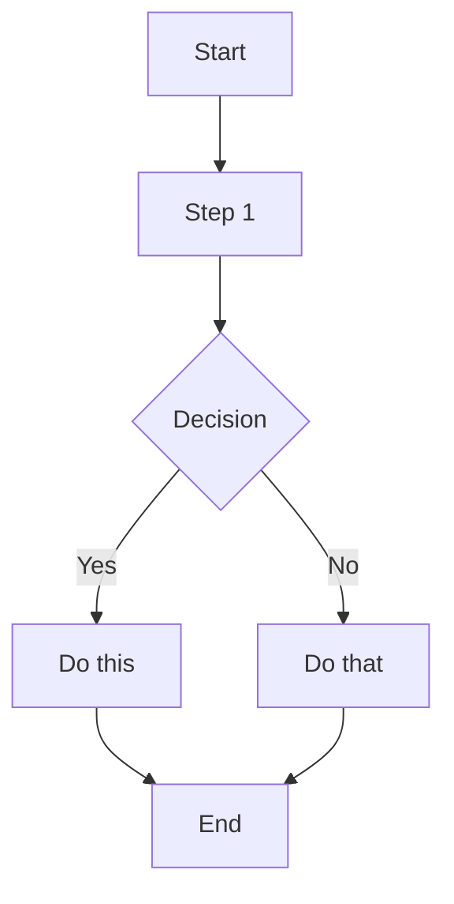
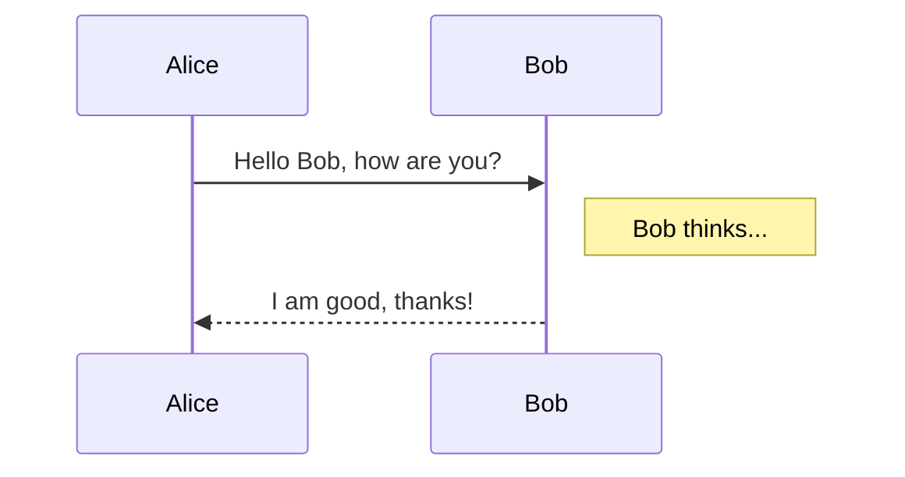

# 1. Najprostszy działający przykład Mermaid

```mermaid
graph TD
    A[Start] --> B[Step 1]
    B --> C{Decision}
    C -->|Yes| D[Do this]
    C -->|No| E[Do that]
    D --> F[End]
    E --> F[End]
```

# 2. Działający sequence diagram w Mermaid

```mermaid
sequenceDiagram
    participant Alice
    participant Bob

    Alice->>Bob: Hello Bob, how are you?
    Note right of Bob: Bob thinks...
    Bob-->>Alice: I am good, thanks!
```
